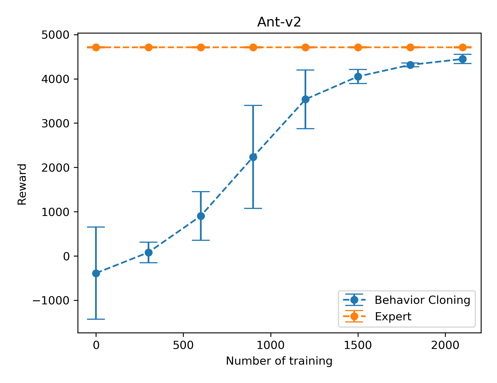
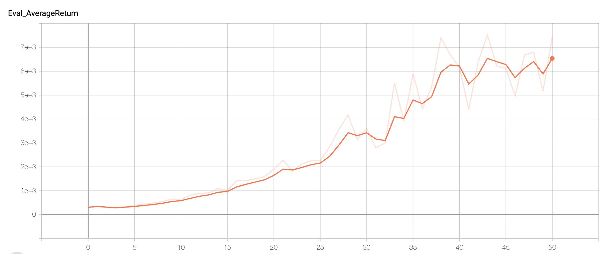

**Notice**: Due to python3 needs to run tensorflow 2, many APIs in the sample code break. As a result, tf.compat.v1 prefix is used instead. If you are using tensorflow 1.x, you do not need tf.compat.v1 prefix.

## Behavior Cloning

```bash
python cs285/scripts/run_hw1_behavior_cloning.py --expert_policy_file cs285/policies/experts/Ant.pkl --env_name Ant-v2 --exp_name test_bc_ant --n_iter 1 --expert_data cs285/expert_data/expert_data_Ant-v2.pkl --eval_batch_size 5000 --video_log_freq -1

python cs285/scripts/run_hw1_behavior_cloning.py --expert_policy_file cs285/policies/experts/Humanoid.pkl --env_name Humanoid-v2 --exp_name test_bc_humanoid --n_iter 1 --expert_data cs285/expert_data/expert_data_Humanoid-v2.pkl --eval_batch_size 5000 --video_log_freq -1
```

|                |   Ant   | Humanoid |
| :------------: | :-----: | :------: |
|  Expert Mean   | 4713.65 | 10344.52 |
| Imitation Mean | 2710.78 |  339.88  |
|   Expert Std   |  12.20  |  20.98   |
| Imitation Std  | 1225.05 |  77.87   |

### Hyperparameter

Run **run.sh** script: ./cs285/scripts/run.sh

```bash
for i in {0..2100..300}
do
	python cs285/scripts/run_hw1_behavior_cloning.py --expert_policy_file cs285/policies/experts/Ant.pkl --env_name Ant-v2 --exp_name test_bc_ant --n_iter 1 --expert_data cs285/expert_data/expert_data_Ant-v2.pkl --num_agent_train_steps_per_iter $i --eval_batch_size 5000 --video_log_freq -1
done
```




## DAgger

```bash
python cs285/scripts/run_hw1_behavior_cloning.py --expert_policy_file cs285/policies/experts/Humanoid.pkl --env_name Humanoid-v2 --exp_name test_bc_humanoid --n_iter 51 --do_dagger --expert_data cs285/expert_data/expert_data_Humanoid-v2.pkl --num_agent_train_steps_per_iter 5000 --eval_batch_size 5000 --video_log_freq -1
```



From the recorded video, it can clearly be seen that the humanoid starts to learn how to run at later steps.