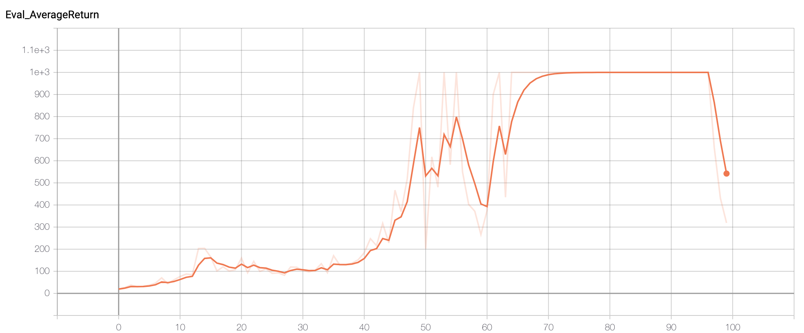

**Notice**: Due to python3 needs to run tensorflow 2, many APIs in the sample code break. As a result, tf.compat.v1 prefix is used instead. If you are using tensorflow 1.x, you do not need tf.compat.v1 prefix.

## Code Analysis

First, we need to copy many code from hw1 to hw2. In hw2, it is essentially doing Monte Carlo Policy Gradient. There are totally 1 or 2 NN involved. One NN is for policy mapping observations to actions. The other optional NN is for baseline estimation.
This NN is used when estimating baseline to be subtracted from Q value to estimate advantage, otherwise advantage is the same as Q value.
Every step, a new sample is rolled out based on the current policy, Q value is estimated to be the sum of discounted rewards (MC). Advantage is then estimated with or without baseline. Then loss function is calculated.
Notice loss function is defined as:


Intuitively, this loss function allows us to increase the weight for actions that yielded a positive reward, and decrease them for actions that yielded a negative reward.
The goal then becomes minimizing this loss function which in result does a gradient descent update in the policy network. If baseline is used, another loss function is defined as
the difference between predicted and actual baseline (Q - Q_avg)/std(Q). Then we do another gradient descent update in the baseline network to update baseline.

## Results

After filling in the code. We can run the examples specified in the pdf. Here are some of the results.

### Problem 3: CartPole

```bash
python run_hw2_policy_gradient.py --env_name CartPole-v0 -n 100 -b 1000 -dsa --exp_name sb_no_rtg_dsa
python run_hw2_policy_gradient.py --env_name CartPole-v0 -n 100 -b 1000 -rtg -dsa --exp_name sb_rtg_dsa
python run_hw2_policy_gradient.py --env_name CartPole-v0 -n 100 -b 1000 -rtg --exp_name sb_rtg_na
python run_hw2_policy_gradient.py --env_name CartPole-v0 -n 100 -b 5000 -dsa --exp_name lb_no_rtg_dsa
python run_hw2_policy_gradient.py --env_name CartPole-v0 -n 100 -b 5000 -rtg - dsa --exp_name lb_rtg_dsa
python run_hw2_policy_gradient.py --env_name CartPole-v0 -n 100 -b 5000 -rtg --exp_name lb_rtg_na
```

Here are the results of Average Return for these different scenarios.


It can be seen with the following conclusions:
* Using advantage standardization helps, but not by a lot. Advantage is normalized.
* Larger batch size helps. More stable gradient step.
* Using reward-to-go helps than using full rewards. This is due to lower variance using reward-to-go.

### Problem 4: InvertedPendulum

I tried batch size **5000** and learning rate **0.005** and am able to get to optimum less than 100 iterations. Below are the command and result graph.

```bash
python run_hw2_policy_gradient.py --env_name InvertedPendulum-v2 --ep_len 1000 --discount 0.9 -n 100 -l 2 -s 64 -b 5000 -lr 0.005 -rtg --exp_name ip_5000_5e-3
```



### Problem 6: LunarLander

Starting from here we are actually using the baseline NN (with *nn_baseline* specified). Since it is training two NNs now and much bigger batch size, it is slower.

```bash
python run_hw2_policy_gradient.py --env_name LunarLanderContinuous-v2 --ep_len 1000 --discount 0.99 -n 100 -l 2 -s 64 -b 40000 -lr 0.005 -rtg --nn_baseline --exp_name ll_b40000_r0.005
```

Result:


I did not do Problem 7 but it should be similar.