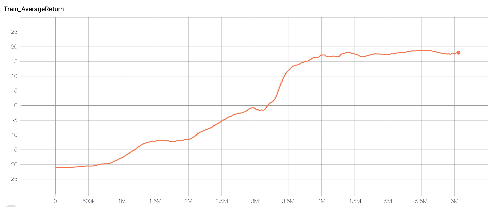
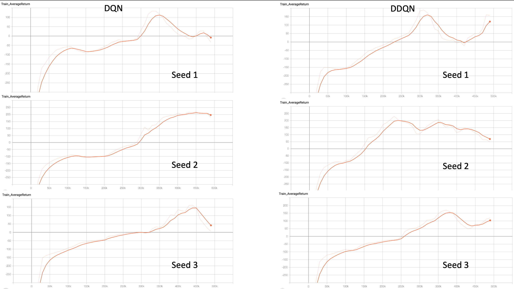
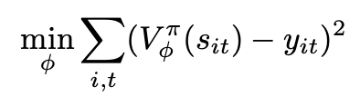
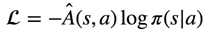
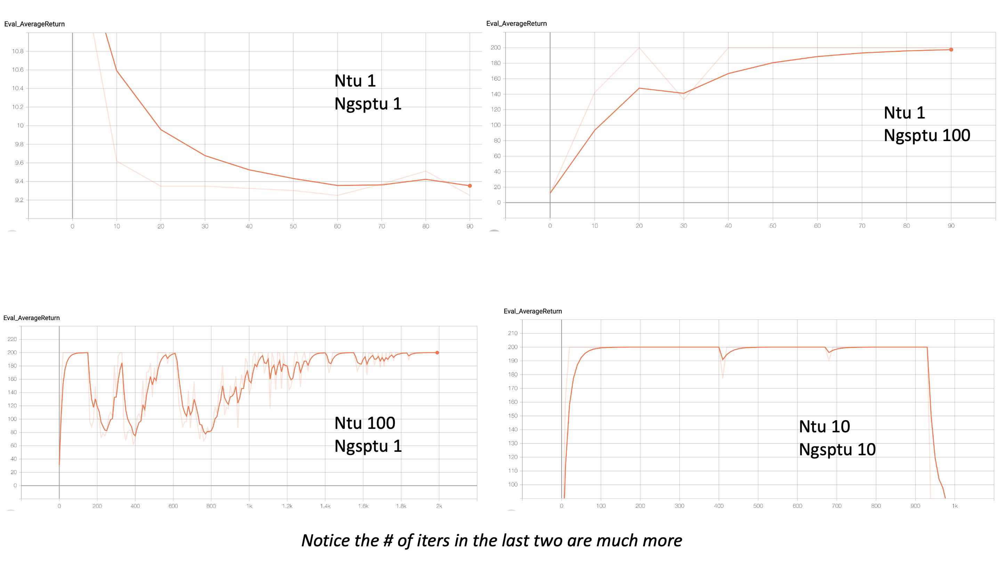
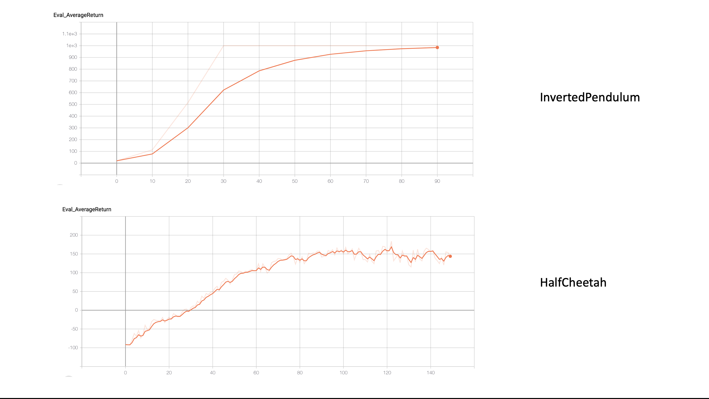
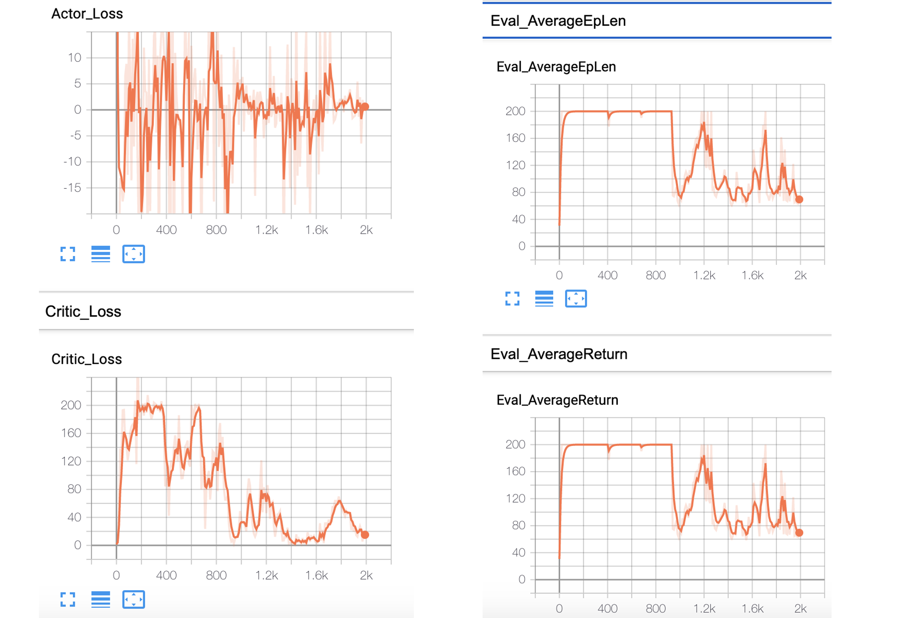

**Notice**: Due to some of the APIs have dependency on tf1, use tensorflow==1.15.0

## Q-Learning (DQN)

In DQN, a NN is used to estimate the Q(s, a) function. There are two NN models being used here, one is *atari_model* (Convolutional + fully connected layers) and the other is *lander_model* (fully connected layers). We are fitting this Q function by minimizing the difference between target Q-value *r + max(Q(s', a'))* and *Q(s, a)*. We store the weights of the same NN a few updates before as the target Q function and update it periodically. In double q-learning, the target Q function is also used to estimate the target Q-value which becomes *r + Q'(s', argmax(Q(s', a')))*.

### Basic Q-Learning (DQN)

```bash
python cs285/scripts/run_hw3_dqn.py --env_name PongNoFrameskip-v4 --exp_name test_pong
```



### Double Q-learning (DDQN)

```bash
python cs285/scripts/run_hw3_dqn.py --env_name LunarLander-v2 --exp_name test_lunar --seed 1
python cs285/scripts/run_hw3_dqn.py --env_name LunarLander-v2 --exp_name test_lunar --seed 2
python cs285/scripts/run_hw3_dqn.py --env_name LunarLander-v2 --exp_name test_lunar --seed 3
python cs285/scripts/run_hw3_dqn.py --env_name LunarLander-v2 --exp_name test_lunar_ddqn --double_q --seed 1
python cs285/scripts/run_hw3_dqn.py --env_name LunarLander-v2 --exp_name test_lunar_ddqn --double_q --seed 2
python cs285/scripts/run_hw3_dqn.py --env_name LunarLander-v2 --exp_name test_lunar_ddqn --double_q --seed 3
```



It can be seen with the following conclusions:
* Between different seeds, there are some variances of the learning curve.
* Between DQN and DDQN, there is no significant differences. Perhaps in average, DDQN has slightly higher rewards.

## Actor-Critic

In DQN, we estimate Q function Q(s, a) for each state-action pair, and the actor uses argmax policy to pick the action that yields the action that returns the highest Q(s, a) value. In Actor-Critic, instead of estimating Q function, our critic is a value function that estimates state value function V(s). Then advantage can be calculated as *r + discount * V(s') - V(s)*, this is also TD(0). With advantage, we can then do the normal policy gradient to update the policy/actor network. So there are a total of 2 NNs, one is the critic NN that estimates V(s) given s, the other is actor NN that estimates action given s.

For critic NN, loss function is the difference between target value function and value function. It is expressed as:



For actor NN, loss function is as usual:



We would need to update these NNs periodically.

### Cartpole

Here are some different commands with different *num_target_updates* and *num_grad_steps_per_target_update*.

```bash
python cs285/scripts/run_hw3_actor_critic.py --env_name CartPole-v0 -n 100 -b 1000 --exp_name 1_1 -ntu 1 -ngsptu 1
python cs285/scripts/run_hw3_actor_critic.py --env_name CartPole-v0 -n 100 -b 1000 --exp_name 100_1 -ntu 100 -ngsptu 1
python cs285/scripts/run_hw3_actor_critic.py --env_name CartPole-v0 -n 100 -b 1000 --exp_name 1_100 -ntu 1 -ngsptu 100
python cs285/scripts/run_hw3_actor_critic.py --env_name CartPole-v0 -n 100 -b 1000 --exp_name 10_10 -ntu 10 -ngsptu 10
```

And here is the result. It can be seen that *num_target_updates = 10* and *num_grad_steps_per_target_update = 10* seems like the best option.



### More difficult tasks: InvertedPendulum and HalfCheetah

```bash
python cs285/scripts/run_hw3_actor_critic.py --env_name InvertedPendulum-v2 --ep_len 1000 --discount 0.95 -n 100 -l 2 -s 64 -b 5000 -lr 0.01 --exp_name 10_10 -ntu 10 -ngsptu 10
python cs285/scripts/run_hw3_actor_critic.py --env_name HalfCheetah-v2 --ep_len 150 --discount 0.9 --scalar_log_freq 1 -n 150 -l 2 -s 32 -b 30000 -eb 1500 -lr 0.02 --exp_name 10_10 -ntu 10 -ngsptu 10
```

And here is the result. It can be seen that they reach the goal return within the experimented iterations.



## Remaining question

One thing I don't quite understand is that sometimes returned rewards hit MAX first but then drop later. When comparing to the critic loss, it can often be seen that critic loss is high when rewards are high, but lower when rewards are lower.

My understanding is that we are trying to minimize critic loss to train critic NN, and that's driving the decrease of critic loss. However, advantage function which contributes to actor loss is actually defined as the critic loss we are minimizing! What this means is that if we do a good job minimizing the critic loss, the advantage function will approach zero which means no action is particularly favorable. Therefore, sub-optimal action may be chosen and cause total reward to drop.

Here is an example:

