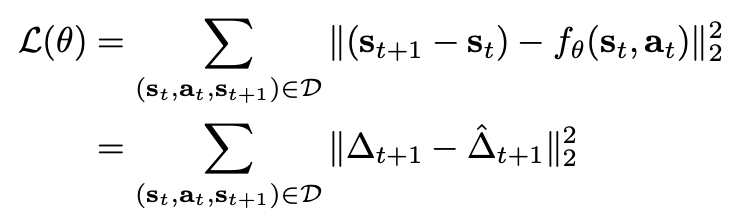
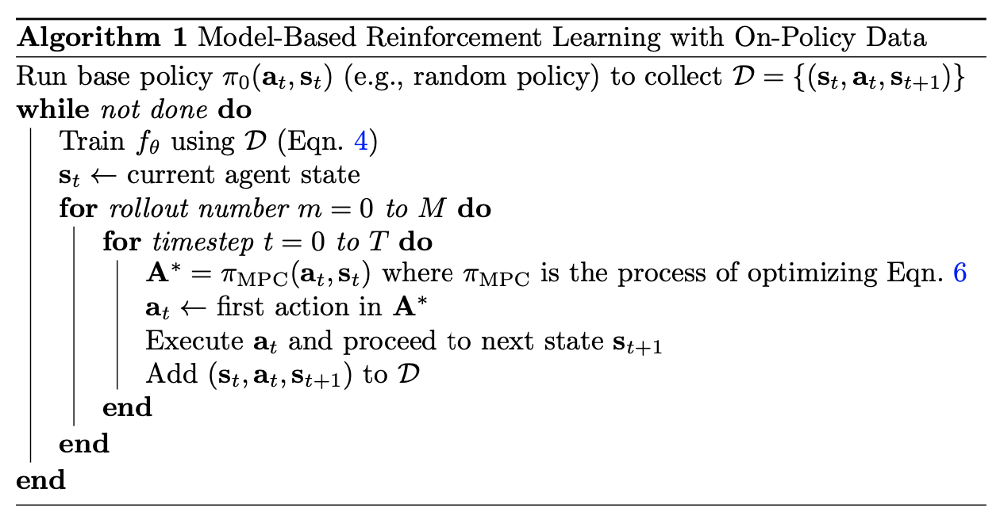
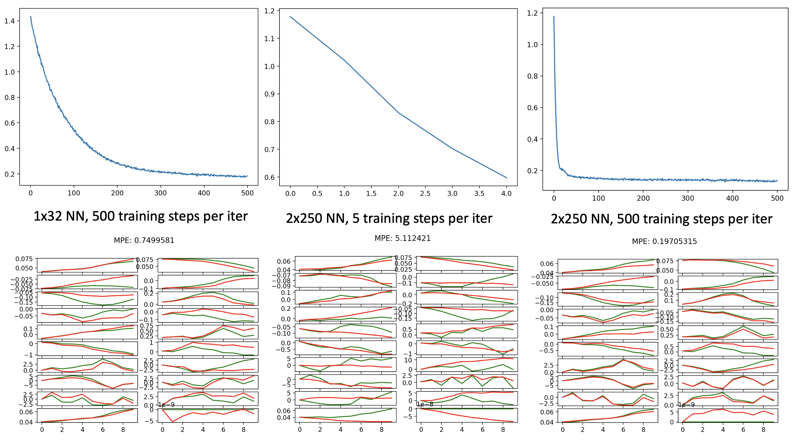
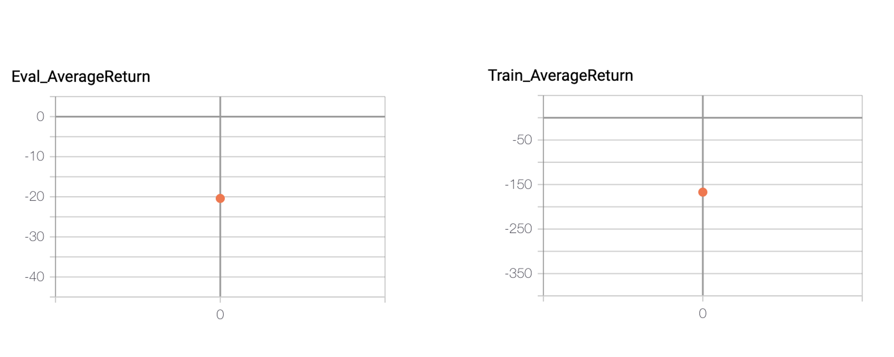
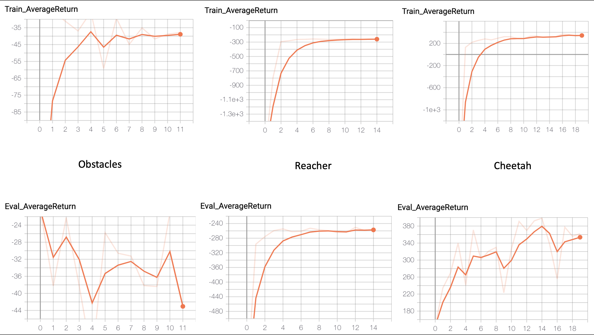
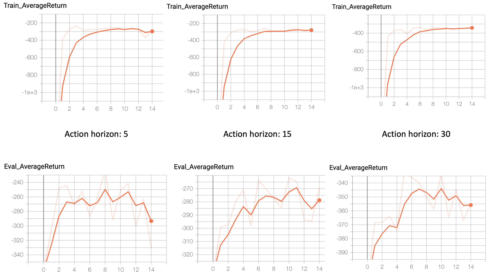
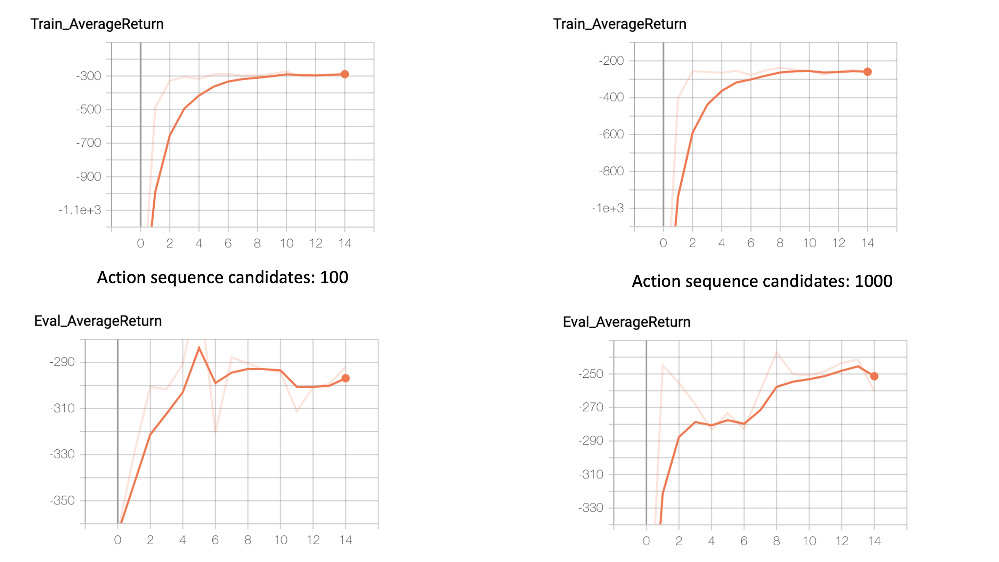
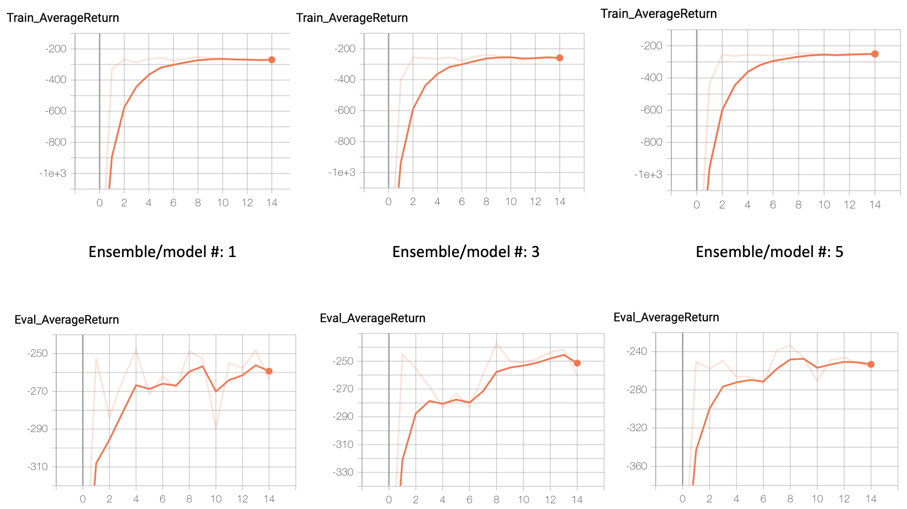

**Notice**: Due to some of the APIs have dependency on tf1, use tensorflow==1.15.0. Also only uploaded data for Question 1, since the other ones have large videos. If you want, you can add the flag *--video_log_freq -1* to disable video log and upload the smaller log.

## Model-Based Reinforcement Learning

In Model Based RL, usually there are two components: learning the dynamics (model) and learning the actions (planning). Once the dynamics is learned, there are different ways for the action selection. There are two main categories of this action selection component: model-based or model-free. Model-based means using the just learned model to do MCTS, MPC (Model prediction control), etc. which basically rolls out different sequences of actions, using the model to predict the sequence of states, collect the rewards, and decide action based on the action sequence that returns the highest reward. Model-free means using the model to generate samples, then use standard model-free RL method to learn Q function or policy, also called Dyna method.

In this exercise, we learn the model and use model-based (MPC) method to learn what action to take at any timestamp.

### Dynamics Model

To learn the dynamics, we construct a NN to predict the next state based on current state and action. We also sample the simulator to get the true next state. Then we can construct loss function as followed. Notice delta is the state difference.



### Action Selection

Here is the algorithm for action selection.



After collecting some (s, a, s', r) using the current model (or models if we ensemble multiple dynamics models), we rollout M different action sequences each has a horizon of T timestamps. We then collect the accumulated rewards for each action sequence, and pick the action sequence which gives the highest reward (lowest cost). Then we only execute the first action in this action sequence, and get the next state. Now we just acquired a new sample (s, a, s', r) which can be used to retrain the model NN.

#### Question 1

This part we only focus on model training, no action selection. We will randomly sample action sequences and collect their next state ground truth to train the NN. The first command uses a NN of 1x32 and 500 train steps per iter; the second command uses a NN of 2x250 and 5 train steps per iter; and the third command uses a NN of 2x250 and 500 train steps per iter.

```bash
python cs285/scripts/run_hw4_mb.py --exp_name cheetah_n500_arch1x32 --env_name cheetah-cs285-v0 --add_sl_noise --n_iter 1 --batch_size_initial 20000 --num_agent_train_steps_per_iter 500 --n_layers 1 --size 32 --scalar_log_freq -1 --video_log_freq -1
python cs285/scripts/run_hw4_mb.py --exp_name cheetah_n5_arch2x250 --env_name cheetah-cs285-v0 --add_sl_noise --n_iter 1 --batch_size_initial 20000 --num_agent_train_steps_per_iter 5 --n_layers 2 --size 250 --scalar_log_freq -1 --video_log_freq -1
python cs285/scripts/run_hw4_mb.py --exp_name cheetah_n500_arch2x250 --env_name cheetah-cs285-v0 --add_sl_noise --n_iter 1 --batch_size_initial 20000 --num_agent_train_steps_per_iter 500 --n_layers 2 --size 250 --scalar_log_freq -1 --video_log_freq -1
```

Results:



It can be seen with the following conclusions:
* Between different training steps of the same NN (2 and 3), more training steps help as it is taking more gradient steps.
* Between different NNs (1 and 3), more NN helps as it provides more complex model.

#### Question 2

Now, we both train the models and do action selection. Here to show the initial difference between training and evaluation (later they tend to become similar), we run *n_iter* for only 1 time.

```bash
python cs285/scripts/run_hw4_mb.py --exp_name obstacles_singleiteration --env_name obstacles-cs285-v0 --add_sl_noise --num_agent_train_steps_per_iter 20 --n_iter 1 --batch_size_initial 5000 --batch_size 1000 --mpc_horizon 10
```

Now we can see the result between training return and evaluation return as:



We can clearly see that training loss is much lower than evaluation loss meaning training process has not finished.

#### Question 3

Now we are running the action algorithm in Action Selection chapter on three sims: obstacles, reacher and cheetah. You can see the different iteration numbers (all > 10). 

```bash
python cs285/scripts/run_hw4_mb.py --exp_name obstacles --env_name obstacles-cs285-v0 --add_sl_noise --num_agent_train_steps_per_iter 20 --batch_size_initial 5000 --batch_size 1000 --mpc_horizon 10 --n_iter 12
python cs285/scripts/run_hw4_mb.py --exp_name reacher --env_name reacher-cs285-v0 --add_sl_noise --mpc_horizon 10 --num_agent_train_steps_per_iter 1000 --batch_size_initial 5000 --batch_size 5000 --n_iter 15
python cs285/scripts/run_hw4_mb.py --exp_name cheetah --env_name cheetah-cs285-v0 --mpc_horizon 15 --add_sl_noise --num_agent_train_steps_per_iter 1500 --batch_size_initial 5000 --batch_size 5000 --n_iter 20
```

And here is the result:



It can be seen that all three tasks learn quite well in the end, despite some fluctuations.

#### Question 4

Now this question, we are comparing different hyperparameters: the number of models in your ensemble, the number of random action sequences considered during each action selection, and the MPC planning horizon. All the tests are on reacher sim and 15 iterations.

```bash
python cs285/scripts/run_hw4_mb.py --exp_name q4_reacher_horizon5 --env_name reacher-cs285-v0 --add_sl_noise --mpc_horizon 5 --num_agent_train_steps_per_iter 1000 --batch_size 800 --n_iter 15
python cs285/scripts/run_hw4_mb.py --exp_name q4_reacher_horizon15 --env_name reacher-cs285-v0 --add_sl_noise --mpc_horizon 15 --num_agent_train_steps_per_iter 1000 --batch_size 800 --n_iter 15
python cs285/scripts/run_hw4_mb.py --exp_name q4_reacher_horizon30 --env_name reacher-cs285-v0 --add_sl_noise --mpc_horizon 30 --num_agent_train_steps_per_iter 1000 --batch_size 800 --n_iter 15

python cs285/scripts/run_hw4_mb.py --exp_name q4_reacher_numseq100 --env_name reacher-cs285-v0 --add_sl_noise --mpc_horizon 10 --num_agent_train_steps_per_iter 1000 --batch_size 800 --n_iter 15 --mpc_num_action_sequences 100
python cs285/scripts/run_hw4_mb.py --exp_name q4_reacher_numseq1000 --env_name reacher-cs285-v0 --add_sl_noise --mpc_horizon 10 --num_agent_train_steps_per_iter 1000 --batch_size 800 --n_iter 15 --mpc_num_action_sequences 1000

python cs285/scripts/run_hw4_mb.py --exp_name q4_reacher_ensemble1 --env_name reacher-cs285-v0 --ensemble_size 1 --add_sl_noise --mpc_horizon 10 --num_agent_train_steps_per_iter 1000 --batch_size 800 --n_iter 15
python cs285/scripts/run_hw4_mb.py --exp_name q4_reacher_ensemble3 --env_name reacher-cs285-v0 --ensemble_size 3 --add_sl_noise --mpc_horizon 10 --num_agent_train_steps_per_iter 1000 --batch_size 800 --n_iter 15
python cs285/scripts/run_hw4_mb.py --exp_name q4_reacher_ensemble5 --env_name reacher-cs285-v0 --ensemble_size 5 --add_sl_noise --mpc_horizon 10 --num_agent_train_steps_per_iter 1000 --batch_size 800 --n_iter 15
```

And here is the result.



It can be seen that shorter horizons seem having better performance than longer horizons. Possibly due to poor model prediction at long horizon.



It can be seen that more action sequences has better performance than fewer action sequence candidates. Since we are only picking the best action sequence, more candidates mean there is a higher possibility of some good action combinations.



Lastly, it can be seen that number of ensemble models does not seem to matter too much, although more models seem slightly better. This means performance is quite similar between different models so the variance of the models is quite small. This means the possibility that this model is completely wrong is relatively small (since all M models have to be wrong in the same way to have a similar average).
