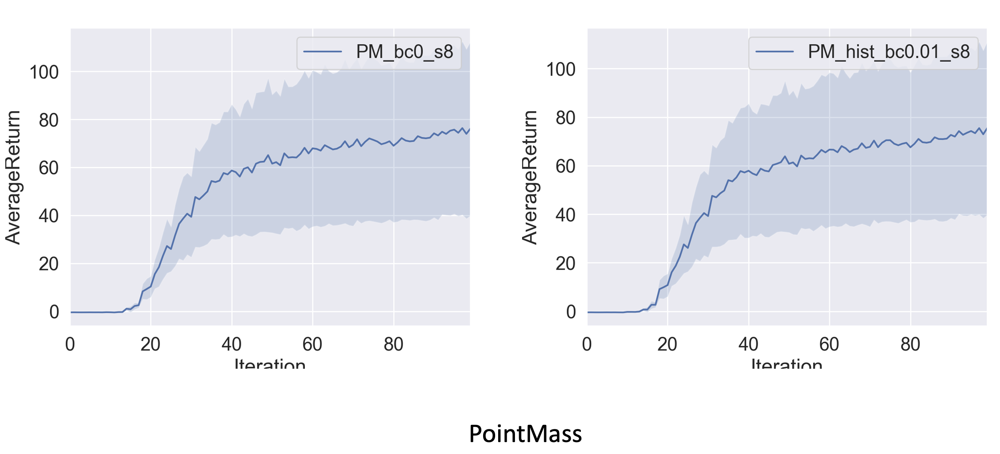
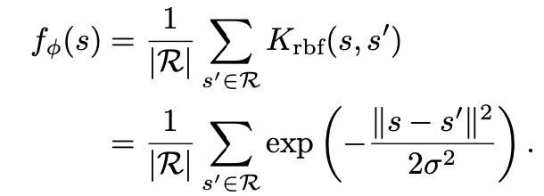
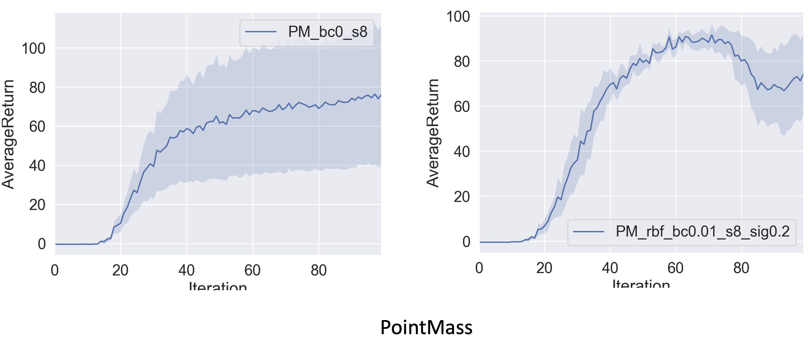
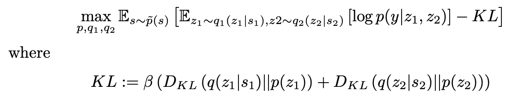
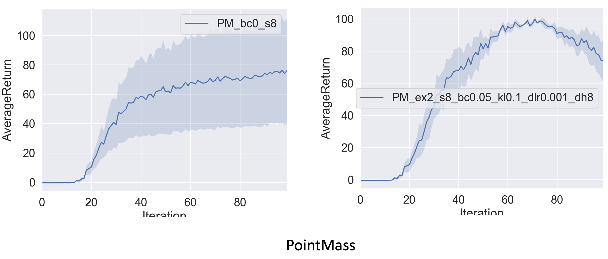
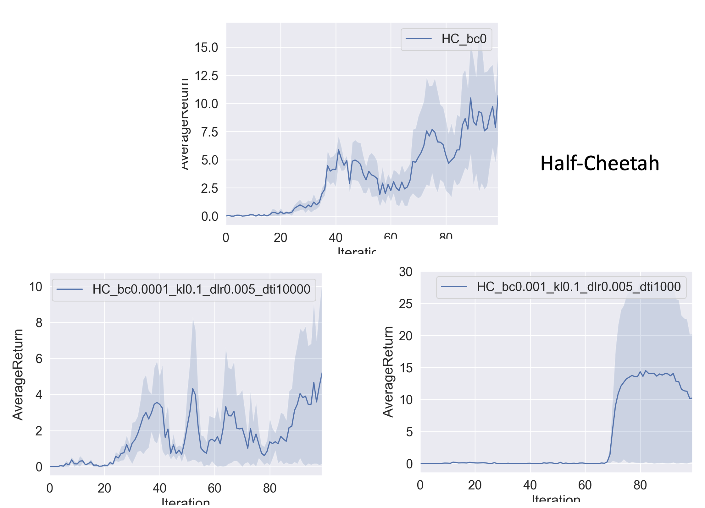

**Notice**: Due to some of the APIs have dependency on tf1, use tensorflow==1.15.0.

## Exploration

Exploration strategy is important to make sure most states are visited. Other than the simple epsilon-greedy type of strategy, a common strategy is to add a bonus exploration reward term to the reward function. This bonus term is usually larger when a state is less visited. Then we can use standard model-free RL learning method (here use actor-critic) to train actor and critic NNs with the modified reward function.

### How to know how often a state is visited?

This is the main thing to figure out. There are two separated cases: discrete and continuous. In discrete case, the exact states are possibly revisited multiple times, so the counts are saved in some histograms. In continuous case, it's more tricky because rarely would an exact state be visited twice. As a result, we need to way to generate a distribution of the visited states, and find similarity between a candidate state and visited states.

#### Question 1: count-based reward bonus and histogram density model

We start with discrete cases, and save the number of visited states in a histogram. Here are the commands to train two different Actor-Critic NNs, one with exploration and one without exploration.

```bash
python train_ac_exploration_f18.py PointMass-v0 -n 100 -b 1000 -e 3 --density_model none -s 8 --exp_name PM_bc0_s8
python train_ac_exploration_f18.py PointMass-v0 -n 100 -b 1000 -e 3 --density_model hist -bc 0.01 -s 8 --exp_name PM_hist_bc0.01_s8
```

Results:



It can be seen that there is no significant difference between exploration and no exploration.

#### Question 2: continuous states using the kernel density estimator with the radial basis function kernel

Now, we move on to the continuous states case. The first way to estimate the state density is a non-parametric way: kernel density estimation. Basically, given a history of states, we can get a Gaussian distribution of the distribution of the states, and then measure the similarity between a new state and this averaged distribution by:



```bash
python train_ac_exploration_f18.py PointMass-v0 -n 100 -b 1000 -e 3 --density_model rbf -bc 0.01 -s 8 -sig 0.2 --exp_name PM_rbf_bc0.01_s8_sig0.2
```

Results:



It can be seen that exploration does get higher reward around 60-80 iterations meaning it is visiting high reward states. Reward does decrease later on meaning more exploration backfires?

#### Question 3: continuous states using the EX2 discriminator

The second way to estimate the state density for continuous states is a parametric way. We create a NN to train a discriminator to distinguish between exemplar states s and the states s′ from the replay buffer. The loss function of this NN is:



We are trying to overfit (try to maximize the log likelihood more) and underfit (try to make the latent distribution as close to a standard Gaussian as possible). The overfit part makes sure similar latent states z_1 and z_2 get high p, while the underfit part makes sure latent states stay a wide distribution as much as possible. The underfit part may also be replaced with maximizing the entropy of q(z|s) instead of its KL-divergence with standard Gaussian distribution.

The reason we introduce latent states z here is because we want z to introduce noise in the discriminator to prevent it from overfitting and encourage it to assign similar probability density to similar states. To get the mapping from observation state s to latent state z, q(z|s), we build another encoder NN and train on it. However, there is only one loss function (EX2_loss) that trains both the discriminator NN and the encoder NN. The reason is the input of the discriminator NN is the output of the encoder NN, thus both NNs can be trained together. Perhaps encoder NN can also be trained separately via a encoder-decoder NN?

```bash
python train_ac_exploration_f18.py PointMass-v0 -n 100 -b 1000 -e 3 --density_model ex2 -s 8 -bc 0.05 -kl 0.1 -dlr 0.001 -dh 8 --exp_name PM_ex2_s8_bc0.05_kl0.1_dlr0.001_dh8
```

Results:



It can be seen that similar to KDE, it achieves high reward around 60-80 iterations, but then drop. In general, rewards increase monotonically in no exploration case but may not reach a very high level. This makes sense since there is no bonus for exploration so actor will always the action which returns the highest rewards that come from the environment. However, it may stuck at local minimum due to no exploration. With no exploration, we may get higher rewards, but it is not stable to stay at high rewards due to exploration. The design of exploration-exploitation may need to be further fine-tuned.

#### Question 4: experiments on Half-Cheetah env with no exploration and two exploration settings

Questions 1-3 were run on PointMass env, here we simply apply the same code to Half-Cheetah environment. The following three commands are on no exploration and two explorations with different settings.

```bash
python train_ac_exploration_f18.py sparse-cheetah-cs285-v1 -ep 150 --discount 0.9 -n 100 -e 3 -l 2 -s 32 -b 30000 -lr 0.02 --density_model none --exp_name HC_bc0
python train_ac_exploration_f18.py sparse-cheetah-cs285-v1 -ep 150 --discount 0.9 -n 100 -e 3 -l 2 -s 32 -b 30000 -lr 0.02 --density_model ex2 -bc 0.001 -kl 0.1 -dlr 0.005 -dti 1000 --exp_name HC_bc0.001_kl0.1_dlr0.005_dti1000
python train_ac_exploration_f18.py sparse-cheetah-cs285-v1 -ep 150 --discount 0.9 -n 100 -e 3 -l 2 -s 32 -b 30000 -lr 0.02 --density_model ex2 -bc 0.0001 -kl 0.1 -dlr 0.005 -dti 10000 --exp_name HC_bc0.0001_kl0.1_dlr0.005_dti10000
```

Results:



In this half-cheetah example, different exploration settings have very different performances. No exploration actually performs decently well comparing to with exploration.
